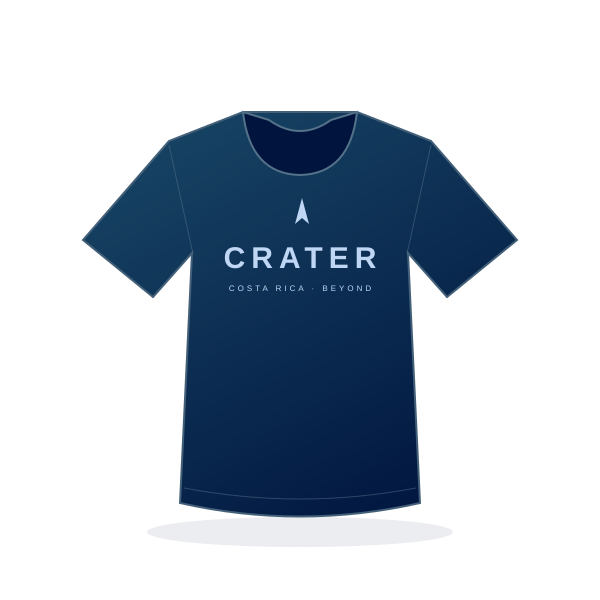

# Manual de la web de CRATER

## 1. La idea, sin tecnicismos

Piensa en esta web como una vitrina:

- **Las páginas son la vitrina.** Ya están construidas.
- **Los archivos JSON son las fichas que colocas dentro.** Ahí escribes los nombres, precios, historias y personas.
- **La carpeta `public` es el álbum de imágenes.** Ahí guardas fotos y logotipos.

Para añadir un proyecto o cambiar un precio **no necesitas programar**. Solo editas una ficha, guardas y revisas la web.

```text
TÚ EDITAS                       LA WEB LO MUESTRA
src/data/proyectos.json   ────>  /proyectos y proyectos destacados de Inicio
src/data/productos.json   ────>  /merch
src/data/equipo.json      ────>  /equipo y cifras de Inicio
src/data/trayectoria.json ────>  /trayectoria
src/data/patrocinadores.json -> /patrocinadores
src/data/sitio.json       ────>  Inicio, menú, contacto y pie de página
public/images/           ────>  Fotos e ilustraciones
```

**Importante:** esta primera versión tiene datos ficticios. Los nombres de integrantes, proyectos, años, cifras, hitos, productos y precios son ejemplos. No afirman participaciones ni resultados reales. Las ilustraciones son conceptuales. No hay patrocinadores ficticios publicados. Las categorías de apoyo son una propuesta editable.

La merch es **solo un catálogo**. No hay carrito, cobros, reservas ni pasarelas de pago. El botón «Ver detalles» únicamente abre información.

## 2. Abrir la web en tu computadora

Necesitas Node.js 22.13 o posterior; se recomienda la última revisión de Node 22 LTS. La versión usada inicialmente fue 22.22.2. Necesitas también npm, incluido con Node, y un editor como Visual Studio Code.

1. Abre la carpeta `web_crater` en tu editor.
2. Abre una terminal en esa misma carpeta, donde está `package.json`.
3. La primera vez, o si cambió `package-lock.json`, ejecuta:

   ```bash
   npm ci
   ```

4. Inicia el servidor:

   ```bash
   npm run dev
   ```

5. Abre **http://localhost:3000**. Si ese puerto está ocupado, lee la dirección que aparece en la terminal. También puedes elegir otro:

   ```bash
   npm run dev -- --port 3001
   ```

6. Deja esa terminal abierta. Guarda tus cambios con `Ctrl + S`: la web se actualizará automáticamente. Si no ocurre, recarga el navegador.
7. Para detener el servidor, pulsa `Ctrl + C` en la terminal.

El servidor escucha en `0.0.0.0` para permitir vistas previas y pruebas desde la red local. Utilízalo en una red de confianza. Los comandos se ejecutan siempre desde la raíz del proyecto.

Si una herramienta de vista previa usa un proxy y los botones dejan de responder, abre directamente `http://localhost:3000`. El proxy puede bloquear la conexión de recarga en caliente de Next.js. Para una vista previa sin esa conexión, usa una compilación de producción en otro puerto:

```bash
npm run build
npm start -- --port 3001
```

Luego conecta la herramienta a `http://localhost:3001`. Esa vista es una compilación fija: para ver nuevos cambios debes volver a compilar y reiniciar ese servidor. No es necesario desactivar las protecciones de origen de Next.js.

### Rutas disponibles

| Dirección local | Contenido |
| --- | --- |
| `/` | Presentación general, cifras, pilares, proyectos destacados y alianzas |
| `/trayectoria` | Línea de tiempo, encuentros, competencias y avances |
| `/equipo` | Estadísticas, líderes, project managers y áreas |
| `/proyectos` | Catálogo de proyectos, filtros y fichas técnicas |
| `/patrocinadores` | Aliados agrupados por categoría y propuesta de apoyo |
| `/merch` | Catálogo, búsqueda, categorías y detalles de cada producto |

## 3. Entender un JSON: una ficha y una lista

Una ficha empieza con `{` y termina con `}`. Una lista empieza con `[` y termina con `]`.

```json
{
  "nombre": "Camiseta CRATER",
  "precio": 12000,
  "tallas": ["S", "M", "L"],
  "destacado": true
}
```

Este ejemplo explica la sintaxis, **no es un archivo completo para reemplazar productos.json**.

| Símbolo | Significado |
| --- | --- |
| `"nombre"` | Nombre del campo. No lo traduzcas ni lo cambies. |
| `"Camiseta CRATER"` | Texto. Va entre comillas dobles. |
| `12000` | Número. Sin comillas, moneda ni separadores de miles. |
| `true` / `false` | Sí / no, sin comillas y en minúsculas. |
| `["S", "M", "L"]` | Lista de tallas. |
| `,` | Separa campos o fichas. No va después del último elemento. |

**Las tres reglas de oro:**

1. Usa comillas dobles `"`, no comillas simples ni comillas curvas de Word.
2. Coloca una coma **entre** elementos, nunca después del último.
3. No pegues comentarios, código Markdown ni los delimitadores de los bloques de este manual dentro del JSON.

Ejemplo visual de dos fichas:

```text
"items": [
  { ficha del primer producto },  ← coma: viene otra ficha
  { ficha del segundo producto } ← sin coma: es la última
]
```

Este dibujo es orientativo, no JSON para copiar. Si un texto incluye comillas, escápalas: `"Colección \"Órbita\""`.

**No borres el archivo entero para pegar una ficha.** Busca la lista correspondiente y añade el nuevo objeto dentro. Haz una copia de seguridad o usa Git antes de un cambio grande.

## 4. Añadir o modificar un proyecto

Abre **`src/data/proyectos.json`**.

- `encabezado`: textos de la parte superior de la página.
- `estados`: opciones de los filtros.
- `items`: lista de proyectos.

### Ejemplo completo de una nueva ficha

Copia este objeto dentro de `items`. Puedes reutilizar la ilustración incluida para probar:

```json
{
  "id": "turrialba-01",
  "nombre": "Turrialba 01",
  "tipo": "Cohetería experimental",
  "estado": "En diseño",
  "descripcion": "Una nueva plataforma universitaria de aprendizaje e integración.",
  "imagen": "/images/cohete.svg",
  "imagenAlt": "Ilustración conceptual del cohete Turrialba 01",
  "anio": "2027",
  "destacado": true,
  "especificaciones": [
    { "etiqueta": "Enfoque", "valor": "Recuperación" },
    { "etiqueta": "Etapa", "valor": "Diseño conceptual" },
    { "etiqueta": "Equipo", "valor": "Multidisciplinario" }
  ]
}
```

```text
┌──────────────────────────────────────┐
│ TURRIALBA-01 / 2027        En diseño  │
│                                      │
│           [imagen del cohete]        │
├──────────────────────────────────────┤
│ COHETERÍA EXPERIMENTAL               │
│ Turrialba 01                         │
│ Una nueva plataforma universitaria… │
│ Ficha del proyecto                → │
│   Enfoque              Recuperación │
└──────────────────────────────────────┘
```

| Campo | Qué debes poner |
| --- | --- |
| `id` | Identificador único: letras minúsculas sin tildes, números y guiones. Ejemplo: `turrialba-01`. No lo repitas. |
| `nombre` | Nombre visible. Aquí sí puedes usar tildes y espacios. |
| `tipo` | Familia del proyecto: cohete, aviónica, investigación, etc. |
| `estado` | Debe coincidir exactamente con un valor de `estados`. |
| `descripcion` | Explicación en lenguaje sencillo. |
| `imagen` | Ruta desde `public`, sin escribir la palabra `public`. |
| `imagenAlt` | Descripción de lo que se ve, para lectores de pantalla. |
| `anio` | Año de cuatro cifras entre comillas. |
| `destacado` | `true` para proponerlo para Inicio; `false` para mostrarlo solo en Proyectos. |
| `especificaciones` | Lista libre de parejas `etiqueta` y `valor`. Puede estar vacía: `[]`. |

Inicio muestra **como máximo los dos primeros proyectos con `destacado: true`**, siguiendo el orden de `items`. Para elegirlos, reordena las fichas. Si no hay destacados, esa sección de Inicio se oculta.

Para cambiar el avance, edita solo `estado`. Los estados iniciales son `En diseño`, `En construcción`, `En pruebas` y `Completado`. Puedes añadir otro texto a la lista `estados`; aparecerá automáticamente como filtro.

## 5. Añadir un producto de merch

Abre **`src/data/productos.json`**. Añade un objeto dentro de `items`:

```json
{
  "id": "camiseta-horizonte",
  "nombre": "Camiseta Horizonte",
  "categoria": "Camisetas",
  "precio": 13500,
  "descripcion": "Camiseta del equipo en azul oscuro. Diseño de ejemplo pendiente de producción.",
  "tallas": ["S", "M", "L", "XL"],
  "imagen": "/images/camiseta.svg",
  "imagenAlt": "Camiseta azul oscuro con el nombre CRATER en el pecho",
  "disponibilidad": "Próximamente"
}
```

```text
┌──────────────────────────────┐
│ Próximamente                 │
│        [foto del producto]   │
├──────────────────────────────┤
│ CAMISETAS                    │
│ Camiseta Horizonte   ₡13 500 │
│ Tallas: S · M · L · XL        │
│ Ver detalles               ↗ │
└──────────────────────────────┘
              ↓ clic
┌──────────────────────────────┐
│ Ficha con foto y descripción │
│ Precio + tallas + estado     │
│ Sin carrito y sin pagos      │
└──────────────────────────────┘
```

Ilustración local de ejemplo, no fotografía de un producto real:



### Precios

```text
CORRECTO                      INCORRECTO
"precio": 13500               "precio": "₡13.500"
"precio": 13500.50            "precio": 13,500
```

El formato visual lo aplica la web. `moneda: "CRC"` usa colones y `locale: "es-CR"` usa el formato regional costarricense. El espaciado exacto puede variar según el navegador. Los decimales se conservan hasta dos posiciones. Cambiar `moneda` a `USD` **no convierte precios**: tendrías que actualizar sus importes.

### Categorías y tallas

- `categoria` debe coincidir con una entrada de `categorias`, respetando tildes y mayúsculas.
- Para añadir gorras, agrega `"Gorras"` a `categorias` y úsala en el producto.
- Para stickers, usa `"tallas": ["Única"]`.
- `disponibilidad` es texto libre: `Próximamente`, `Disponible` o `Agotado`, por ejemplo. No hay control automático de inventario.
- `nota` aparece en la página y en los detalles. Actualízala cuando los precios sean oficiales, pero conserva la aclaración de que es un catálogo.
- La búsqueda ignora diferencias de mayúsculas y tildes.
- Para quitar un producto, elimina su objeto completo de `items` y revisa las comas de los objetos vecinos. También puedes dejar `"items": []` para un catálogo vacío.

## 6. Actualizar el equipo

Abre **`src/data/equipo.json`**.

### Estadísticas

```json
{
  "valor": "30",
  "etiqueta": "Integrantes del equipo",
  "detalle": "Información actualizada en septiembre de 2026"
}
```

Añade o modifica estos objetos dentro de `estadisticas`. `valor` es texto: puede ser `"30"`, `"30+"` o `"6"`.

**Las cifras son manuales.** No se calculan contando los perfiles o proyectos: una web puede mostrar solo al liderazgo, aunque el equipo tenga muchas más personas. Esta lista también alimenta las cifras de Inicio.

### Liderazgo, project managers y otros integrantes

Dentro de `miembros`, añade:

```json
{
  "id": "persona-ejemplo",
  "nombre": "Nombre Apellido",
  "rol": "Project Manager · Turrialba 01",
  "area": "Ingeniería mecánica",
  "bio": "Coordina el proyecto y conecta a sus distintas áreas de trabajo.",
  "foto": "",
  "grupo": "Project managers"
}
```

- Si `foto` está vacía (`""`), aparece un recuadro con las iniciales. No se inventa una fotografía.
- Para mostrar un retrato, guarda una foto en `public/images` y usa, por ejemplo, `"foto": "/images/persona-ejemplo.jpg"`.
- `grupo` organiza automáticamente los perfiles. Puedes usar `Liderazgo`, `Project managers`, `Integrantes` u otra agrupación. Respeta la escritura para no crear grupos duplicados.
- Los grupos aparecen según su primera aparición en la lista; las personas, en el orden de sus fichas.
- Publica nombres, fotos y biografías únicamente con autorización.

`areas` contiene los bloques que explican cómo se organiza el equipo. Cada uno tiene `nombre` y `descripcion`. También puedes editar `liderazgoTitulo`, `liderazgoDescripcion` y `areasTitulo`.

## 7. Añadir un hito a la trayectoria

Abre **`src/data/trayectoria.json`** y añade dentro de `hitos`:

```json
{
  "id": "presentacion-2027",
  "fecha": "2027-03-15",
  "categoria": "Divulgación",
  "titulo": "Compartimos nuestro nuevo proyecto",
  "descripcion": "Presentación de los avances del equipo ante la comunidad universitaria. Ejemplo que debe reemplazarse por un evento real.",
  "lugar": "Costa Rica"
}
```

```text
2026  ●──── Un hito anterior
      │
2027  ●──── Compartimos nuestro nuevo proyecto
      │     marzo de 2027 · Divulgación
      │     Costa Rica
```

- `fecha` debe ser una fecha real con formato **AAAA-MM-DD**. Por ejemplo, `2027-03-15` significa 15 de marzo de 2027.
- La web ordena de lo más antiguo a lo más reciente, independientemente de dónde pegues la ficha.
- La tarjeta muestra mes y año; el día sirve para ordenar.
- Puedes usar categorías como `Equipo`, `Desarrollo`, `Competencia` o `Divulgación`. Aquí son texto libre.
- Para competencias, escribe el nombre real, resultado y contexto en el título y la descripción. No dejes la competencia ficticia de demostración en una web oficial.
- `cierreTitulo` y `cierreDescripcion` controlan el bloque al final de la línea de tiempo.

## 8. Añadir patrocinadores y cambiar categorías

Abre **`src/data/patrocinadores.json`**.

Inicialmente encontrarás:

```json
"items": []
```

Esto significa «todavía no hay patrocinadores». La web muestra una invitación a colaborar, no logotipos inventados.

### Añadir el primer patrocinador

Cuando haya una alianza confirmada, reemplaza esa propiedad por una lista como esta:

```json
"items": [
  {
    "id": "aliado-ejemplo",
    "nombre": "Nombre del aliado",
    "categoria": "orbita",
    "logo": "/images/aliado-ejemplo.png",
    "url": "",
    "descripcion": "Descripción real del apoyo al proyecto."
  }
]
```

**Antes de guardar**, coloca la imagen correspondiente en `public/images/aliado-ejemplo.png`. Ese archivo no viene incluido: es un ejemplo del nombre que puedes usar.

- `categoria` apunta al **id** de una categoría, no a su nombre visible.
- Los ids iniciales son `impulso`, `orbita` y `horizonte`.
- `url` puede quedar vacía. Si hay una web oficial, pega su dirección completa que empiece por `https://`. Se abrirá en otra pestaña.
- Las tarjetas se agrupan automáticamente por categoría.
- Al agregar un aliado, desaparece el mensaje de que no hay patrocinadores.

### Crear otra categoría

Añade dentro de `categorias`:

```json
{
  "id": "colaborador",
  "nombre": "Colaborador académico",
  "nivel": "04",
  "descripcion": "Conocimiento y acompañamiento para seguir aprendiendo.",
  "aporte": "Mentoría, formación o acceso a laboratorios",
  "beneficios": [
    "Reconocimiento en la web",
    "Intercambio con estudiantes"
  ]
}
```

Luego podrás usar `"categoria": "colaborador"` en un patrocinador. Las tarjetas respetan el orden de la lista; la segunda tiene un tratamiento visual destacado.

No hay montos obligatorios ni promesas contractuales. Las categorías y beneficios iniciales son ejemplos; acuerda las condiciones reales antes de publicarlas. Actualiza también `notaCategorias`.

### Activar el contacto

En `src/data/sitio.json`, cambia `email` de vacío a un correo oficial. Por ejemplo, **solo como muestra de formato**:

```json
"email": "equipo@example.org"
```

No publiques ese correo de ejemplo: sustitúyelo por uno real. Al configurar un correo, aparece «Escríbenos» y el contacto del pie de página. El botón abre el cliente de correo de la persona; no envía mensajes automáticamente ni existe un formulario conectado a un servidor.

Mientras `email` siga vacío, se muestra `contactoPendiente` de `patrocinadores.json`.

## 9. Cambiar Inicio, menú, logo y redes

Abre **`src/data/sitio.json`**.

| Campo o sección | Qué controla |
| --- | --- |
| `nombre`, `nombreCompleto` | Identidad y pie de página |
| `descripcion` | Descripción general para metadatos |
| `ubicacion` | País o ubicación visible |
| `logo` | Imagen de marca |
| `hero` | Etiqueta, título, frase destacada, descripción, botones, nota e ilustración de Inicio |
| `inicio.pilares` | Los tres bloques sobre diseño, equipo y exploración; puedes modificar la lista |
| Resto de `inicio` | Textos de presentación, destacados y llamada a patrocinadores |
| `navegacion` | Nombres y orden de los seis enlaces del menú y del pie |
| `email` | Correo oficial, o `""` para no mostrarlo |
| `redes` | Lista de nombres y enlaces a perfiles oficiales |
| `pie` | Lema y frase inferior |
| `modoDemo`, `avisoDemo` | Aviso de contenido ficticio y comportamiento de indexación |

Ejemplo de estructura de una red, **solo para ilustrar el formato**:

```json
"redes": [
  { "nombre": "Perfil oficial", "url": "https://example.com" }
]
```

Reemplaza la URL por el perfil real antes de publicar. Deja `"redes": []` si todavía no quieres mostrar enlaces. Se admiten enlaces HTTPS, no direcciones ejecutables ni enlaces sin protocolo.

Los textos de contenido se pueden actualizar desde estos JSON. Algunas etiquetas fijas de interfaz, como «Buscar productos», y la composición visual están en los componentes. **Añadir contenido no requiere código; añadir una ruta nueva, una función o cambiar el diseño sí requiere desarrollo.** La navegación valida únicamente las seis páginas existentes para evitar enlaces rotos.

### Particularidad del logo

El archivo entregado originalmente se llama **`public/Logo.jpeg`**, con `L` mayúscula. Se conserva sin alterar. `next.config.ts` hace que la ruta solicitada `/logo.jpeg` también lo encuentre.

En Linux, `Logo.jpeg` y `logo.jpeg` no son el mismo nombre. Para reemplazar el logo de forma sencilla, sustituye el contenido de `public/Logo.jpeg` manteniendo el nombre. El logo original incluye márgenes blancos: la barra usa un recorte circular para mostrar el escudo.

Si utilizas un diseño con otras proporciones y el recorte no le favorece, un desarrollador puede ajustar `.logo-crop` en los estilos. Puedes cambiar `logo` a otra ruta local, pero evita dejar una referencia a un archivo inexistente.

## 10. Preparar imágenes sin romper nada

```text
Archivo en tu computadora             Valor del campo imagen
public/images/cohete-real.jpg    ───>  /images/cohete-real.jpg
public/images/camiseta-azul.png  ───>  /images/camiseta-azul.png
```

**Nunca:** `/public/images/cohete-real.jpg`.

Consejos:

- Usa nombres en minúsculas, sin espacios ni tildes: `cohete-irazu.jpg`.
- Se admiten JPG/JPEG, PNG, WebP y SVG locales. Usa SVG solo de fuentes de confianza.
- Evita fotos enormes; una imagen de unos 1200 píxeles de ancho suele ser suficiente. Optimiza el peso antes de subirla.
- Para productos, funcionan bien imágenes cuadradas. Para miembros, retratos cuadrados. Para proyectos, fotos con el objeto centrado y margen alrededor.
- La web guarda imágenes en el propio repositorio: no depende de un banco de fotos externo.
- No uses fotos ni logotipos sin permiso.
- `imagenAlt` describe la imagen para personas que usan lectores de pantalla. Ejemplo: «Equipo ensamblando el fuselaje en el taller».
- Los archivos en `public` son públicos. No pongas allí contraseñas, documentos privados ni datos personales sensibles.

## 11. Comprobar que todo quedó bien

Después de editar, ejecuta:

```bash
npm run validate:data
```

Comprueba los seis JSON, campos, ids, fechas, categorías, estados y existencia de imágenes. También se ejecuta automáticamente antes de compilar producción.

Si hay un error, puede aparecer algo así:

```text
Revisa src/data/productos.json:
items.1.precio: El precio no puede ser negativo
```

Traducción: abre `productos.json`, busca el **segundo** producto y corrige `precio`. Los índices empiezan en cero: `0` = primero, `1` = segundo.

Una comprobación completa:

```bash
npm run lint
npm run typecheck
npm test
npm run build
```

| Comando | Para qué sirve |
| --- | --- |
| `npm run validate:data` | Revisa contenido e imágenes. |
| `npm run lint` | Revisa buenas prácticas del código. |
| `npm run typecheck` | Comprueba tipos de TypeScript. |
| `npm test` | Prueba reglas de validación sin abrir un navegador. |
| `npm run build` | Construye las seis páginas para producción. |
| `npm start` | Sirve una compilación existente. Ejecuta primero `npm run build`. |

### Pruebas automáticas de navegador

La primera vez:

```bash
npx playwright install chromium
```

Después:

```bash
npm run test:e2e
```

Se comprueban las seis rutas, móvil y escritorio, carga de imágenes, desbordamientos, navegación, filtros, fichas y cierre de los detalles con Escape. Las pruebas usan el puerto 3000: reutilizan un servidor de desarrollo existente o arrancan uno temporal. No ejecutes otra aplicación en ese puerto durante las pruebas.

Las capturas y trazas quedan en `test-results/`, excluido de Git. En Linux, si Chromium informa de bibliotecas del sistema ausentes, solicita a quien administra el equipo que instale las dependencias oficiales de Playwright. No necesitas Chromium para editar el contenido ni para compilar la web.

### Antes de publicar contenido real

- [ ] Reemplazar o retirar **todos** los proyectos, cifras, integrantes, productos e hitos ficticios.
- [ ] Confirmar precios, tallas, disponibilidad y categorías de apoyo.
- [ ] Obtener permiso para nombres, fotos y logotipos.
- [ ] Configurar correo y redes oficiales; no dejar datos de ejemplo.
- [ ] Revisar los textos que dicen «ejemplo», «conceptual» o «demostración».
- [ ] Ejecutar `npm run validate:data` y `npm run build`.
- [ ] Revisar móvil y escritorio.
- [ ] Solo entonces cambiar `"modoDemo": true` a `"modoDemo": false`.

`modoDemo: false` retira el aviso general, las etiquetas de cifras de ejemplo de Inicio y permite indexación en los metadatos. **No reemplaza ni limpia los datos ficticios por sí solo.** Mientras sea `true`, se solicita a los buscadores que no indexen las páginas; no es una medida de privacidad.

## 12. Guardar y publicar cambios con GitHub

Repositorio del proyecto: **`git@github.com:fabricioarce/web_crater.git`**.

Para cambios pequeños, también puedes editar los JSON desde la interfaz de GitHub: abre el archivo, pulsa el lápiz, modifica y crea un commit. Sube las imágenes a `public/images` con el mismo nombre usado en el JSON. Es preferible probar localmente antes.

Desde la terminal:

```bash
git status
git diff
npm run validate:data
npm run build
git add src/data public/images
git commit -m "Actualiza el catálogo y los proyectos"
git push origin main
```

`git add` selecciona lo que subes. Ajusta las rutas si también cambiaste otros archivos. Revisa `git diff` y no publiques contraseñas ni archivos privados. Si trabajan varias personas, coordinen los cambios y preferiblemente usen ramas y pull requests; no sobrescriban trabajo ajeno.

**Subir a GitHub no publica automáticamente una web en Internet.** Este repositorio todavía necesita un despliegue si se quiere una dirección pública permanente. Puede usarse una plataforma compatible con Next.js o un servidor Node:

```bash
npm ci
npm run build
npm start
```

Las páginas se generan al compilar. En producción, después de modificar JSON o imágenes, debes hacer una **nueva compilación y despliegue**. En desarrollo, basta con guardar.

No es una web HTML para subir directamente a GitHub Pages: el proyecto usa el servidor de Next.js, optimización de imágenes y una regla de compatibilidad para el logo.

## 13. Problemas frecuentes

| Qué sucede | Qué revisar |
| --- | --- |
| No aparece la imagen | Nombre exacto, mayúsculas, extensión y ruta sin `public`. Ejecuta `npm run validate:data`. |
| Sale un error de JSON | Falta una coma, sobró una coma final, hay comillas curvas o llaves sin cerrar. |
| El proyecto no sale en Inicio | `destacado` debe ser `true`; solo aparecen los primeros dos destacados. |
| Un filtro no muestra la ficha | Categoría o estado deben coincidir exactamente con las listas configuradas. |
| La validación dice que el id está repetido | Cambia el id de la ficha nueva por uno único. |
| No aparece «Escríbenos» | `sitio.email` está vacío. Configura el correo oficial. |
| No aparece una persona en el grupo esperado | Revisa la escritura de `grupo`: `Liderazgo` y `liderazgo` son diferentes. |
| Los precios tienen un formato distinto | La moneda y región controlan el formato; no escribas el símbolo en `precio`. |
| Un cambio no aparece en producción | Hay que volver a compilar y desplegar. Un commit por sí solo no modifica un servidor independiente. |
| El puerto 3000 está ocupado | Cierra tu otro servidor o inicia en el 3001; revisa la URL de la terminal. |
| `npm ci` falla por la versión de Node | Usa Node 22.13 o posterior, idealmente Node 22 LTS actualizado. |

## 14. Mapa para quien mantenga el código

```text
web_crater/
├── agents.md                 Directrices del proyecto
├── MANUAL.md                 Este manual
├── package.json              Comandos y dependencias
├── package-lock.json         Versiones reproducibles
├── next.config.ts            Configuración de Next y alias del logo
├── public/
│   ├── Logo.jpeg             Logo original, sin modificar
│   └── images/               Ilustraciones y nuevas fotografías
├── src/
│   ├── app/                  Páginas con App Router
│   │   ├── globals.css       Tailwind 4, paleta y estilos responsivos
│   │   ├── layout.tsx        Layout, metadatos, menú y pie
│   │   └── .../page.tsx      Las seis páginas
│   ├── components/           Navbar, catálogos, tarjetas y pie
│   ├── data/                 Los seis archivos JSON editables
│   └── lib/
│       ├── data-schemas.ts   Validación y reglas de los datos
│       └── data.ts           Carga tipada del contenido
├── scripts/validate-data.ts  Comprobación de imágenes y contenido
└── tests/                    Pruebas de datos y de navegador
```

Stack: Next.js 16 con App Router, React 19, TypeScript y Tailwind CSS 4. Las fuentes Inter y Space Grotesk se sirven localmente; no hace falta conexión con Google Fonts. La validación usa Zod. No se necesitan base de datos, claves API ni variables de entorno para esta estructura base.

La paleta está declarada en el bloque `@theme` de `src/app/globals.css`. Los tonos principales siguen `agents.md`: celeste `#BFD7F5`, azul `#003052` y azul oscuro `#00143D`, con verde, beige, amarillo y rojo como acentos.
